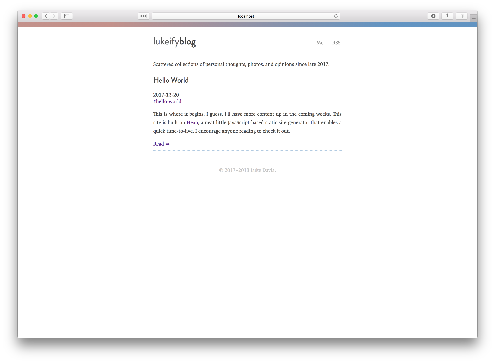

# blog.lukeify.com

[](https://github.com/lukeify/lukeify-blog)
[](https://github.com/lukeify/lukeify-blog)
[](http://blog.lukeify.com)
[](http://blog.lukeify.com)



Personal blog, containing scattered collections of personal thoughts, photos, and opinions since late 2017.

## User Instructions

To view, go to http://blog.lukeify.com.

## Getting Started

For those who would like to fork this repository to use as the basis for their own blog.

### Prerequisites

You will need Node Package Manager, the [Hexo CLI](https://hexo.io) as well as a remote server with nginx available.

### Installation

```
npm install hexo-cli -g
git clone https://github.com/lukeify/lukeify-blog.git
cd lukeify-blog
npm install
```

### Building

Generation of files:

```
hexo generate
```

Test server:

```
hexo server
```


See the [Hexo docs](https://hexo.io/docs/index.html) for more.

## Deployment

Push to GitHub. Then from remote repository:

```
git pull
hexo generate
```

## Built With

* NPM
* Hexo static generator
* Nginx
* Markdown
* Bash

## Versioning

Design & functionality of this site uses [semantic versioning](https://semver.org). Individual posts are outside the scope of versioning.

## Author

Luke Davia.

## License

The design of this repository is licensed under the [MIT License](LICENSE).  The name *lukeify*, and any content posted on this blog are property of the author. For more on this license, [read the summary on tldrlegal.com](https://tldrlegal.com/license/mit-license).
